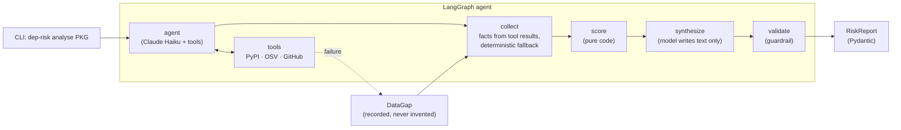

# dep-risk: Dependency Risk Analyst

An AI agent that takes a PyPI package name and produces a structured, auditable risk report from three real sources: **PyPI**, **GitHub** and **OSV.dev**.

The design goal is a report you can trust: **the rating is computed by code, the model only writes the prose, and when a data source fails the report says so instead of guessing.**

```text
$ dep-risk analyse pycrypto --no-llm
{
  "package": "pycrypto",
  "rating": "high",
  "score": 88,
  "confidence": "medium",
  "factors": [
    {"name": "known vulnerabilities", "points": 63,
     "detail": "2 unpatched issues affecting 2.6.1 (worst: CRITICAL, CVE-2013-7459)"},
    {"name": "stale release", "points": 25, "detail": "latest release is 4489 days old"}
  ],
  "data_gaps": [
    {"source": "github", "reason": "no GitHub repository linked from PyPI metadata"}
  ]
}
```

*(Real output, trimmed. Without `--no-llm` the report also contains a `technical_summary` and a short plain-English `executive_summary` written by the model.)*

## How it works



1. **agent ⇄ tools**: the model calls three typed tools. It decides *when* to call them, never *what* to look up: the version and repository URL come from the PyPI result, not from model-supplied arguments, and a different package name is refused. The loop is bounded by `MAX_AGENT_ITERATIONS`.
2. **collect**: facts come from the tool results. If the model didn't finish, or the model call fails, the deterministic `gather_facts` fills in, so a flaky model can't leave a hole in the report.
3. **score**: rating, score and confidence are computed in code from a published rubric. The model never decides them.
4. **synthesize**: the model writes only the narrative (`ReportNarrative`) via structured output. It sees a fenced, clipped facts block; third-party text such as package summaries is treated as data, not instructions.
5. **validate**: the narrative is checked against the computed rating, the data gaps and a list of overclaims ("safe to use", "no risk", ...). If it fails, or no narrative could be produced, a deterministic template replaces it.

### The no-invented-data guardrail

- A source that fails becomes a `DataGap`. `PackageFacts` refuses to exist if a source is `None` without a recorded gap.
- "OSV found nothing" (an empty result) and "OSV could not be reached" (a failure) are different states and never get confused.
- `RiskReport` refuses a LOW rating or HIGH confidence when any data gap exists.
- Tools never raise into the model; they return an "unavailable, do not estimate" message and record the gap.

## Scoring

The score is risk points (higher is worse), summed and capped at 100. Every signal produces an auditable factor, and nothing in the score uses the LLM.

| Signal | Source | Points |
|---|---|---|
| Unpatched vulnerabilities in the latest release | OSV (duplicate GHSA/PYSEC/CVE ids merged) | worst issue: CRITICAL 60, HIGH 50, MODERATE 25, LOW 10, unknown 25; plus 3 per extra issue (extras capped at +10) |
| Latest release yanked | PyPI | +30 |
| Repository archived | GitHub | +35 |
| Age of latest release | PyPI | over 3 years +25; over 18 months +15; over 12 months +8 |
| Last push to the repository | GitHub | over 2 years +15; over 1 year +8 |

**Ratings:** LOW 0-24, MEDIUM 25-49, HIGH 50 and above. Stars and open issues are shown as context but not scored: they are noisy and easy to game.

**Confidence and gaps:**

| Situation | Confidence | Effect |
|---|---|---|
| No gaps | HIGH | none |
| Only GitHub missing (including "no GitHub link found") | MEDIUM | rating cannot be LOW (score floor 25) |
| OSV or PyPI missing | LOW | rating cannot be LOW (score floor 25) |

Full rationale: [docs/scoring-rubric.md](docs/scoring-rubric.md).

## Evaluation
6/6 cases match expectations (Generated 2026-10-05 11:15 UTC).

Full result: [docs/eval-results.md](docs/eval-results.md).

## Quick start

Requires Python 3.12+ and [uv](https://docs.astral.sh/uv/).

```bash
git clone https://github.com/msdawood/dep-risk-analyst.git
cd dep-risk-analyst
uv sync
cp .env.example .env        # then fill in ANTHROPIC_API_KEY (and optionally GITHUB_TOKEN)

uv run dep-risk analyse requests            # agent + model-written summary
uv run dep-risk analyse requests --no-llm   # deterministic score only
```

JSON goes to **stdout** and logs go to **stderr**, so the output can be piped. Exit code 1 means the package was not found or the name was invalid.

### Docker

```bash
docker build -t dep-risk .
docker run --rm --env-file .env dep-risk analyse requests
```

The image (242 MB) is multi-stage, runs as a non-root user and contains no secrets: keys are supplied at run time.

### Configuration

All settings come from environment variables or `.env` (see `src/dep_risk/config.py`).

| Variable | Default | Purpose |
|---|---|---|
| `ANTHROPIC_API_KEY` | required | model access |
| `GITHUB_TOKEN` | unset | raises the GitHub limit from 60 to 5,000 requests/hour |
| `LLM_MODEL` | `claude-haiku-4-5-20251001` | model used for tool calling and the narrative |
| `HTTP_TIMEOUT_SECONDS` | `10` | per-request timeout |
| `HTTP_MAX_ATTEMPTS` | `3` | total attempts for transient failures |
| `MAX_AGENT_ITERATIONS` | `6` | bound on the model/tool loop |
| `LOG_LEVEL`, `LOG_JSON` | `INFO`, `false` | logging |

## Engineering

- `src/` layout, typed Python (`mypy --strict`), `ruff` lint and format, `uv.lock` committed.
- Typed error taxonomy: not found, unavailable, rate limited and invalid response are different failures. Only transient failures are retried (exponential backoff with jitter); rate limits are reported, not hammered.
- HTTP clients take an injected `httpx.AsyncClient`, so tests use recorded responses and never touch the network.
- The model layer is tested with a scripted fake model: tool loop, iteration bound, fallback, guardrail, prompt-injection fencing and wrong-package refusal all run in CI without an API key.
- GitHub Actions runs lint, format check, type check and tests, then builds the Docker image and checks it runs as non-root.

```bash
uv run ruff check . && uv run ruff format --check . && uv run mypy src && uv run pytest
```

## Limitations

These are deliberate scope decisions, not oversights:

- **Only the latest release is checked against OSV.** "No known vulnerabilities" means none were found in the checked sources for that version. It is not a safety guarantee, and the report never says otherwise.
- **GitHub data requires a repository link declared in PyPI metadata.** The tool never guesses a repository from the package name, because a wrong guess would attach another project's activity to the package. Packages that only list a docs site (for example `py`) get a GitHub data gap, MEDIUM confidence and a rating floor of MEDIUM. The same applies to packages hosted on other forges.
- "Last commit" is GitHub's `pushed_at` (last push to any branch), and `open_issues` includes open pull requests, as GitHub counts them.
- Contributor and maintainer-count signals are not fetched in this version.
- OSV results are read from the first page only.
- The rubric is a transparent heuristic, not a validated model. Old but stable libraries can look riskier than they are; age alone gives MEDIUM, never HIGH.
- The overclaim check on the narrative is a phrase list: a backstop for the prompt, not a complete defence.
- `--no-llm` still requires `ANTHROPIC_API_KEY` to be set, because settings are validated at start-up.

## Roadmap

- Evaluation set: run the pipeline on a fixed list of packages and compare against expected ratings.
- Pagination for OSV results and vulnerability history across versions.
- Contributor / bus-factor signal and a requirements-file input.
- Make the API key optional for `--no-llm`.
